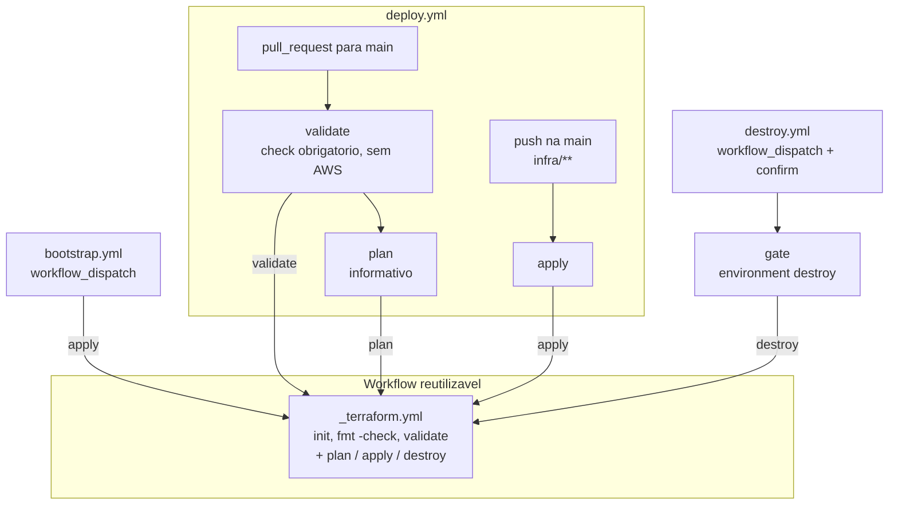

# Pipelines (GitHub Actions)

As pipelines deste repositório cuidam só do banco: o RDS PostgreSQL em [infra/](../../infra). Toda a lógica do Terraform fica em um único **workflow reutilizável** (`_terraform.yml`). Os três workflows de entrada (`bootstrap.yml`, `deploy.yml` e `destroy.yml`) só decidem **quando** chamá-lo e com qual comando.

## Visão geral



> Convenção: workflows que começam com `_` são internos, chamados com `uses: ./.github/workflows/_x.yml`.

## Arquivos

```
.github/workflows/
  _terraform.yml   (workflow_call)     - validate | plan | apply | destroy em infra/
  bootstrap.yml    (workflow_dispatch) - primeira criação / recriação do RDS
  deploy.yml       (pull_request, push) - validate + plan no PR, apply no merge
  destroy.yml      (workflow_dispatch) - remoção do RDS, com confirmação e aprovação
```

---

## 1. `_terraform.yml` (reusable)

Recebe o input `command` (string): `validate`, `plan`, `apply` ou `destroy`. Tem um único job, `terraform`, com `working-directory: infra`.

| Step | validate | plan | apply / destroy |
|---|---|---|---|
| Bloqueio fora da `main` (falha com erro) | — | — | ✔ se `github.ref != refs/heads/main` |
| `actions/checkout@v7` | ✔ | ✔ | ✔ |
| `aws-actions/configure-aws-credentials@v6` | — | ✔ | ✔ |
| `hashicorp/setup-terraform@v4` (Terraform `1.15.8`, sem wrapper) | ✔ | ✔ | ✔ |
| `terraform init -input=false` | com `-backend=false` | ✔ | ✔ |
| `terraform fmt -check -recursive` | ✔ | ✔ | ✔ |
| `terraform validate` | ✔ | ✔ | ✔ |
| `terraform plan -input=false -lock=false` | — | ✔ | — |
| `terraform <cmd> -auto-approve -input=false -lock-timeout=15m` | — | — | ✔ |

- **Senha do RDS:** não usa `terraform.tfvars` no CI. Ela chega pela variável de ambiente nativa `TF_VAR_rds_password: ${{ secrets.RDS_PASSWORD }}`. Os demais valores usam os defaults de [infra/variables.tf](../../infra/variables.tf).
- **Versões fixas:** o Terraform é fixado em `1.15.8` e o provider AWS pelo `infra/.terraform.lock.hcl` versionado. Toda execução é reproduzível.
- **Plan sem lock:** o plan do PR é especulativo e não grava state. Por isso roda com `-lock=false`: não disputa o lock com um apply e não deixa lock órfão se for cancelado.
- **Proteção de branch:** `apply` e `destroy` só rodam quando `github.ref == refs/heads/main`. Em outra branch, o primeiro step **falha com erro**, em vez de pular o job e deixar um run verde que não aplicou nada. Isso impede que um `workflow_dispatch` disparado em outra branch aplique código não revisado. O guard evita engano, mas não é uma barreira contra quem tem permissão de escrita no repositório, porque o workflow da branch pode ser editado.
- **Concorrência** (definida só aqui, não nos callers):
  - `apply` e `destroy` usam o grupo fixo `terraform-database`, com `cancel-in-progress: false`. Nunca rodam dois ao mesmo tempo sobre o state.
  - `validate` e `plan` usam um grupo por comando e por ref, com `cancel-in-progress: true`. Um push novo no PR cancela a verificação anterior, sem afetar os applies.
  - Comportamento padrão do GitHub (`queue: single`): cada grupo mantém no máximo **um** run pendente. Um run novo substitui o pendente anterior. Um Destroy aguardando atrás de um apply em andamento pode, portanto, ser trocado por um Deploy mais novo e aparecer como *cancelled*. Nesse caso, rode o Destroy de novo.

## 2. `bootstrap.yml`

- **Gatilho:** `workflow_dispatch`, manual, a partir da `main`.
- **Job:** `apply` → `_terraform.yml` com `command: apply`.

Use-o na primeira criação do RDS e para recriá-lo depois de um Destroy. Ele exige que a rede do repo K8S já exista (VPC, subnets privadas e SG dos nodes). Também é o caminho para reaplicar a `main` quando um apply de push falhou porque a rede estava ausente, ou depois de trocar o secret `RDS_PASSWORD`.

## 3. `deploy.yml`

É a pipeline de alteração. Os jobs são condicionados pelo evento (`github.event_name`):

| Evento | Job | Comando | Observação |
|---|---|---|---|
| `pull_request` → `main` (sem filtro de paths) | `validate` | `validate` | **Check obrigatório** (`validate / terraform`). Não usa credenciais AWS, então funciona até com a rede destruída |
| `pull_request` → `main`, só de branches deste repo | `plan` (`needs: validate`) | `plan` | Informativo. Mostra o diff, mas falha se a rede do K8S não existir. Em PR de fork é pulado, porque o GitHub não entrega secrets a forks |
| `push` na `main` com mudança em `infra/**`, `deploy.yml` ou `_terraform.yml` | `apply` | `apply` | Aplica o que foi mergeado |

- **PR sem filtro de paths:** o PR não usa filtro de paths de propósito. Se o workflow fosse pulado por filtro, o check obrigatório ficaria *pending* para sempre e travaria PRs que só mexem em documentação.
- **Rede ausente:** se a rede não existir no push, o apply falha de propósito. Um "skip" verde esconderia que a `main` não foi aplicada. Quando a rede voltar, rode o Bootstrap.
- **Não use "Re-run" em um Deploy antigo:** o re-run usa o `github.sha` original e aplicaria um commit desatualizado da `main`. Use o Bootstrap, que aplica a HEAD.

## 4. `destroy.yml`

- **Gatilho:** `workflow_dispatch` com o input obrigatório `confirm`, que deve ser `destroy`. As expressões do GitHub comparam strings sem diferenciar maiúsculas, então `DESTROY` também é aceito.
- **Job `reject`:** roda quando `confirm` não é `destroy` ou a branch não é `main`, e **falha com erro**. Assim um valor digitado errado não termina em um run verde com o RDS ainda de pé.
- **Job `gate`:** roda só na `main` e com `confirm == destroy`, e usa `environment: destroy`. Ele existe à parte porque um job que chama workflow reutilizável (`uses:`) não aceita `environment`.
- **Job `destroy`** (`needs: gate`): chama `_terraform.yml` com `command: destroy`.

Configure o environment `destroy` **antes** do primeiro uso, com *Required reviewers* e *Deployment branches* restrito a `main`. Se não existir, o GitHub o cria sem proteção na primeira execução.

Ordem entre repositórios: destrua o APP/LAMBDA antes deste repo e o K8S depois (veja o [README principal](../../README.md#3-dependências-entre-repositórios)).

---

## Secrets e Variables

Em **Settings → Secrets and variables → Actions**:

| Nome | Tipo | Uso |
|---|---|---|
| `AWS_ACCESS_KEY_ID` | Secret | Credencial do usuário IAM `terraform` (plan, apply, destroy) |
| `AWS_SECRET_ACCESS_KEY` | Secret | Idem |
| `RDS_PASSWORD` | Secret | `TF_VAR_rds_password`. Deve ser igual ao secret do repo APP |
| `AWS_REGION` | Variable | `us-east-1` |

Todos os callers passam os secrets ao workflow reutilizável com `secrets: inherit`. Todos os workflows declaram `permissions: contents: read`.
