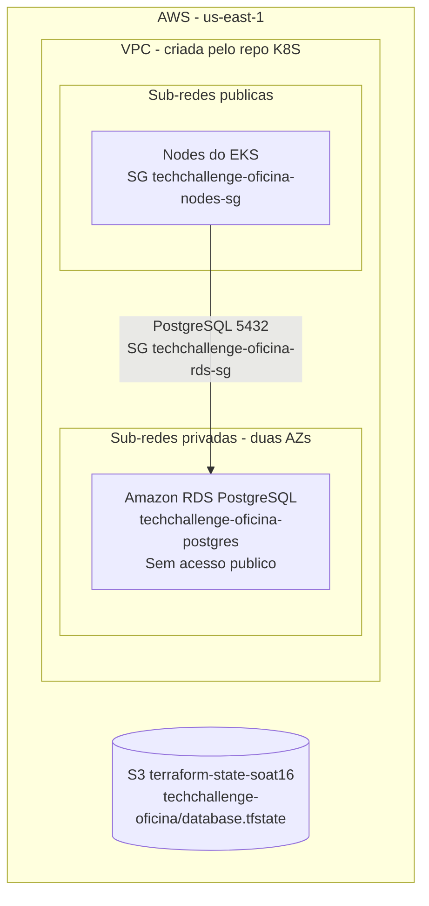

# tech-challenge-fase-3-DB-soat16-rm374658

Infraestrutura do banco de dados do projeto **Tech Challenge Oficina** (SOAT16, fase 3). Aqui fica o Amazon RDS PostgreSQL, criado com Terraform e mantido por pipelines próprias no GitHub Actions.

O repositório não usa código nem state de outro repositório: tem o próprio Terraform state, a própria configuração e os próprios workflows. Para rodar, porém, depende da rede criada pelo repositório **K8S** (seção 3). O schema (tabelas) é criado pela aplicação, no repositório [**APP**](https://github.com/GuiToniello/tech-challenge-fase-3-APP-soat16-rm374658).

## 1. O que é provisionado

Tudo fica na AWS, região `us-east-1`:

| Recurso | Nome | Detalhes |
|---|---|---|
| `aws_db_instance` | `techchallenge-oficina-postgres` | PostgreSQL, `db.t3.micro`, 20 GiB `gp3` criptografado, single-AZ, sem acesso público, porta `5432`, database `oficina`, usuário `sa` |
| `aws_db_subnet_group` | `techchallenge-oficina-rds-subnets` | Usa as duas subnets privadas criadas pelo repo K8S (duas AZs) |
| `aws_security_group` | `techchallenge-oficina-rds-sg` | Este repo cria só a entrada na porta `5432` a partir do SG dos nodes do EKS. O LAMBDA adiciona a própria regra (seção 3) |

É um ambiente acadêmico e descartável: `deletion_protection = false`, `skip_final_snapshot = true` e `backup_retention_period = 0`. Por isso, **um destroy apaga todos os dados**.



## 2. Escolha do banco

A aplicação precisa de persistência relacional: clientes, veículos, serviços, insumos, ordens de serviço e orçamentos, ligados por chaves estrangeiras e com índices únicos (por exemplo, a identificação CPF/CNPJ do cliente). O banco escolhido é o PostgreSQL, acessado com Entity Framework Core e Npgsql. O **RDS** assume a operação do banco (provisionamento, patches, armazenamento criptografado) e o mantém isolado em subnets privadas.

Os detalhes do acesso a dados e das migrations estão no [repositório APP](https://github.com/GuiToniello/tech-challenge-fase-3-APP-soat16-rm374658) (ADR-007, *EF Core com PostgreSQL*, e ADR-009, *Migrações automáticas no startup*). Este repositório só cria a instância e o database vazio `oficina`. As APIs criam as tabelas quando sobem.

## 3. Dependências entre repositórios

### Ordem

| Operação | Ordem |
|---|---|
| Deploy | **K8S** Bootstrap (rede + EKS) → **DB** (este repo) → **APP** Bootstrap (imagens) / **LAMBDA** → **K8S** K8s Apply (manifests + Secret das APIs), disparado automaticamente pelo APP |
| Destroy | **APP** (nada a destruir: o ECR é manual) / **LAMBDA** → **DB** (este repo) → **K8S** |

- Se o K8S for destruído antes do DB, o SG dos nodes ainda é referenciado pela regra do RDS e as subnets privadas ainda têm as ENIs do RDS. O Destroy do repo K8S verifica isso e falha antes de começar se o RDS ainda existir.
- **SG do RDS recriado**, com outro ID. Acontece em Destroy + Bootstrap, ou quando muda o `name`, a `description` ou a VPC do SG. Reaplique o **LAMBDA**: a regra de acesso dele sumiu junto com o SG antigo.
- **Instância do RDS recriada**. Acontece em Destroy + Bootstrap, ou numa mudança que force replace da instância. O banco volta vazio. Rode o workflow **K8s Apply** do repo K8S (`restart-pods = true`), porque as migrations só rodam quando as APIs sobem.

### Contrato consumido (criado pelo repo K8S)

Este repo encontra a rede por tag e nome, via data sources ([infra/data.tf](infra/data.tf)), sem ler o state do K8S:

| O que | Como é encontrado |
|---|---|
| VPC | Tag `Project = techchallenge-oficina` (vem do `default_tags` do provider no repo K8S). Precisa existir **exatamente uma** |
| Subnets privadas | Tag `Name = techchallenge-oficina-private-*`, pelo menos 2, em AZs diferentes |
| SG dos nodes | Nome `techchallenge-oficina-nodes-sg`, na mesma VPC, **anexado aos worker nodes** (launch template do node group) |

Se algum desses itens não existir, o `plan` falha antes de criar qualquer recurso.

### Contrato produzido (usado pelos repos K8S e LAMBDA)

O Secret das APIs (`oficina-api-secrets`, com a connection string) é gerado pelo workflow **K8s Apply** do repo [K8S](https://github.com/GuiToniello/tech-challenge-fase-3-K8S-soat16-rm374658).

| Item | Valor | Onde o K8S usa |
|---|---|---|
| Identifier do RDS | `techchallenge-oficina-postgres` | Variable `RDS_INSTANCE_IDENTIFIER`: o K8s Apply busca o endpoint com `aws rds describe-db-instances`, e o Destroy do K8S verifica se o RDS já foi removido |
| Database | `oficina` | Variable `RDS_DATABASE` |
| Usuário | `sa` | Variable `RDS_USERNAME` |
| Porta | `5432` | Connection string |
| Senha | Secret `RDS_PASSWORD` | Precisa ter **o mesmo valor** neste repo e no K8S |
| SG do RDS | `techchallenge-oficina-rds-sg` | O LAMBDA cria o próprio `aws_vpc_security_group_ingress_rule` neste SG. O Destroy do K8S confere que ele já foi removido |

As regras do SG do RDS são recursos separados (`aws_vpc_security_group_ingress_rule` / `aws_vpc_security_group_egress_rule`), não blocos inline. Assim, uma regra criada por outro repo não é removida no próximo apply deste.

Outputs do Terraform: `rds_identifier`, `rds_endpoint`, `rds_port`, `rds_database` e `rds_security_group_id`.

## 4. Pré-requisitos (manuais, uma vez)

1. **Bucket S3 `terraform-state-soat16`** em `us-east-1`, com versionamento, criptografia e bloqueio de acesso público. É o mesmo bucket dos outros repos: cada repo usa uma key própria. Este usa `techchallenge-oficina/database.tfstate`, com lock nativo (`use_lockfile`).
2. **Usuário IAM `terraform`**, cujas access keys vão para os secrets do GitHub. Permissões necessárias:
   - EC2:
     - `ec2:Describe*`. Os data sources usam, entre outras, `DescribeVpcs`, `DescribeVpcAttribute`, `DescribeSubnets` e `DescribeSecurityGroups`, e o destroy do SG usa `DescribeNetworkInterfaces`. Ações Describe não aceitam restrição por recurso.
     - `ec2:CreateSecurityGroup`, `ec2:DeleteSecurityGroup`
     - `ec2:AuthorizeSecurityGroupIngress`, `ec2:AuthorizeSecurityGroupEgress`, `ec2:RevokeSecurityGroupIngress`, `ec2:RevokeSecurityGroupEgress`
     - `ec2:ModifySecurityGroupRules`, `ec2:CreateTags`, `ec2:DeleteTags`
   - RDS: `rds:*DBInstance*`, `rds:*DBSubnetGroup*`, `rds:AddTagsToResource`, `rds:RemoveTagsFromResource`, `rds:ListTagsForResource`. Se for o primeiro RDS da conta, também `iam:CreateServiceLinkedRole`.
   - S3: `s3:GetObject`, `s3:PutObject` e `s3:DeleteObject` em `techchallenge-oficina/database.tfstate*`, mais `s3:ListBucket` no bucket.
3. **Secrets e Variables do GitHub**: veja a seção 5.
4. **Environment `destroy`** (Settings → Environments). Crie **antes** do primeiro Destroy, com você como *Required reviewer* e *Deployment branches* restrito a `main`. Se ele não existir, o GitHub cria na hora, sem proteção. Não dispare o Destroy com um Deploy ou Bootstrap em andamento (veja a seção 9).
5. **Proteção da branch `main`** (Settings → Branches): exija Pull Request e o status check `validate / terraform`. O check só aparece na lista depois que o primeiro PR rodar a pipeline.

## 5. Secrets e Variables

| Nome | Tipo | Uso |
|---|---|---|
| `AWS_ACCESS_KEY_ID` | Secret | Credencial do usuário IAM `terraform` |
| `AWS_SECRET_ACCESS_KEY` | Secret | Idem |
| `RDS_PASSWORD` | Secret | Senha master do RDS, passada ao Terraform como `TF_VAR_rds_password` |
| `AWS_REGION` | Variable | `us-east-1` |

**Regras para `RDS_PASSWORD`:**
- Use de 8 a 128 caracteres ASCII imprimíveis, **sem** `/`, `'`, `"`, `@`, espaço e `;`.
  - O RDS rejeita os cinco primeiros.
  - O `;` quebra a connection string montada pelo K8s Apply do repo K8S.
- Não reaproveite a senha de desenvolvimento local.

**Rotação da senha:**
1. Atualize o secret `RDS_PASSWORD` aqui e no repo K8S.
2. Rode o workflow **Bootstrap** neste repo. Trocar um secret não dispara o Deploy: o apply só roda com push em `infra/**` ou nos workflows `deploy.yml` / `_terraform.yml`.
3. Rode o **K8s Apply** do repo K8S com `restart-pods = true`.

## 6. Pipelines (GitHub Actions)

| Workflow | Gatilho | O que faz |
|---|---|---|
| **Bootstrap** | Manual (`workflow_dispatch`) | `terraform apply` completo. Serve para a primeira criação e para recriar depois de um Destroy |
| **Deploy** | Pull Request para `main` | `validate` (sem AWS, check obrigatório) → `plan` (informativo; não roda em PR de fork, que não recebe secrets) |
| **Deploy** | Push na `main` com mudança em `infra/**`, `deploy.yml` ou `_terraform.yml` | `terraform apply` |
| **Destroy** | Manual, com input `confirm = destroy` + aprovação | `terraform destroy` |

Apply e destroy só rodam a partir da `main`. Um Bootstrap ou Destroy disparado em outra branch, ou um Destroy com `confirm` diferente de `destroy`, **falha** com erro, em vez de terminar verde sem ter feito nada.

Toda a lógica do Terraform fica no workflow reutilizável `_terraform.yml`. Os detalhes estão em [.github/workflows/README.md](.github/workflows/README.md).

Enquanto a rede do K8S não existir (antes do primeiro deploy do K8S, ou depois de destruído para economizar), o `plan` dos PRs e o `apply` do push falham de propósito. O `validate` continua verde, então os PRs podem ser mergeados. Quando a rede voltar, rode o **Bootstrap** para aplicar o estado da `main`. **Não use "Re-run" em um Deploy antigo que falhou**: o re-run aplica o commit daquele run, que pode estar desatualizado, e desfaria mudanças mergeadas depois. O Bootstrap sempre aplica a HEAD da `main`.

## 7. Uso local

Com a AWS CLI configurada com o usuário `terraform`, a partir de `infra/`:

```powershell
Copy-Item terraform.tfvars.example terraform.tfvars   # e informe rds_password
terraform init
terraform fmt -check -recursive
terraform validate
terraform plan -var-file="terraform.tfvars"
terraform apply -var-file="terraform.tfvars"
```

Em `rds_password`, use **o mesmo valor** do secret `RDS_PASSWORD`. O state é o mesmo do CI, e um valor diferente troca na hora a senha master do RDS (`apply_immediately = true`), derrubando a conexão das APIs. O `terraform.tfvars` é ignorado pelo Git e não deve ser versionado. O `.terraform.lock.hcl` **é** versionado e fixa a versão do provider AWS. Para atualizá-lo, rode `terraform init -upgrade` e depois `terraform providers lock -platform=linux_amd64 -platform=windows_amd64`.

Para validar sem acessar a AWS: `terraform init -backend=false` e `terraform validate`.

## 8. Destruição e custos

O RDS gera custo enquanto existe. Para remover, rode o workflow **Destroy** com `confirm = destroy` e aprove no environment. Respeite a ordem entre repositórios (seção 3). O bucket S3 do state não é removido.

## 9. Troubleshooting

- **`no matching EC2 VPC found` / `no matching EC2 Security Group found` / precondition das subnets (2 AZs):** a rede do repo K8S não existe ou mudou de nome. Confira o contrato da seção 3.
- **`multiple EC2 VPCs matched`:** existe mais de uma VPC com a tag `Project = techchallenge-oficina`. Deve haver só uma.
- **`Error acquiring the state lock`:** outro apply/destroy está rodando. Se o lock ficou preso depois de um run cancelado, rode em `infra/` `terraform force-unlock <LOCK_ID>`, ou apague o objeto `techchallenge-oficina/database.tfstate.tflock` do bucket.
- **Destroy aparece como "cancelled":** no comportamento padrão do GitHub (`queue: single`), um run mais novo no mesmo grupo de concorrência substitui o que estava pendente. Rode o Destroy de novo, sem nenhum Deploy ou Bootstrap em andamento.
